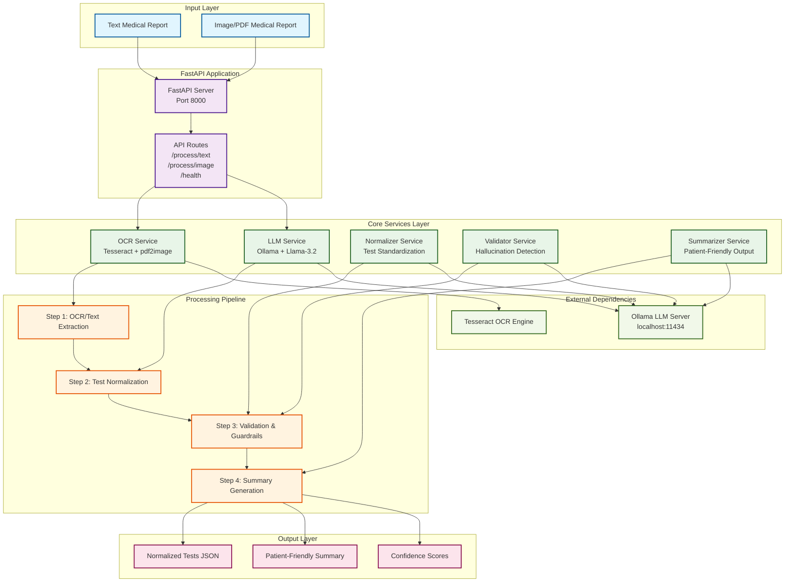
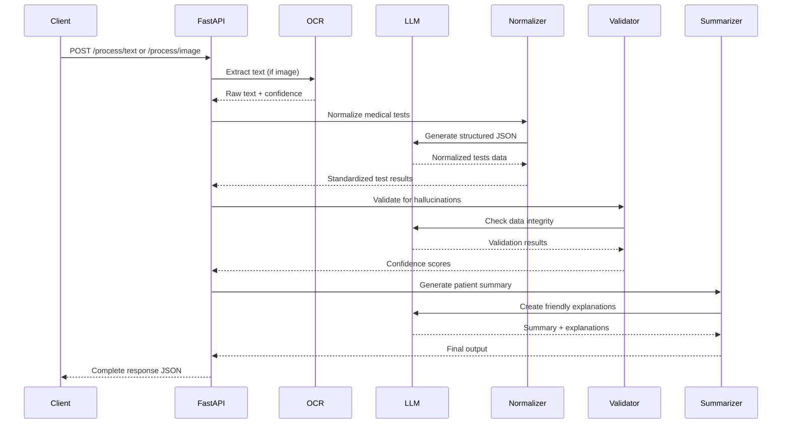
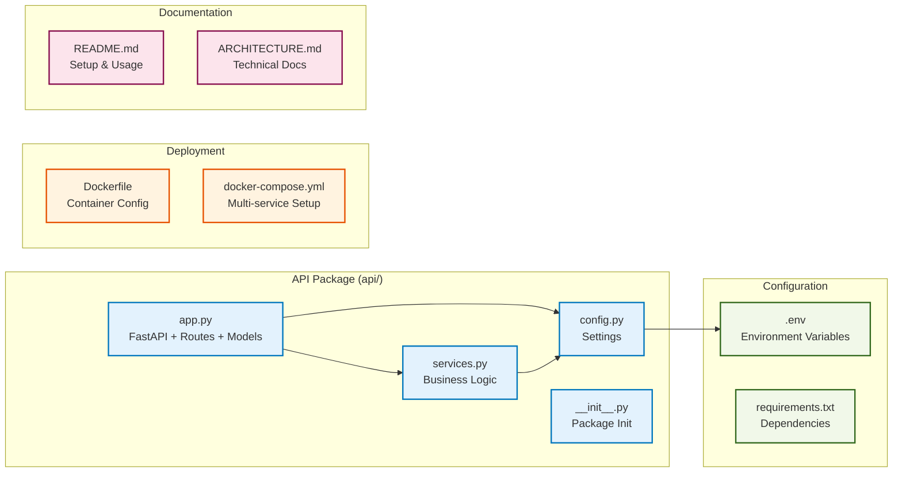
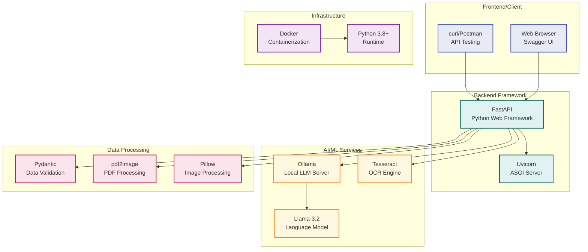
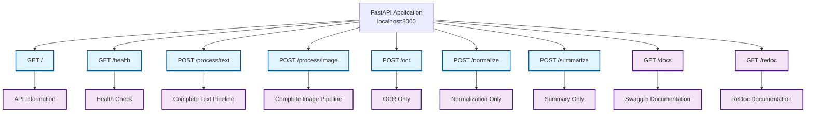
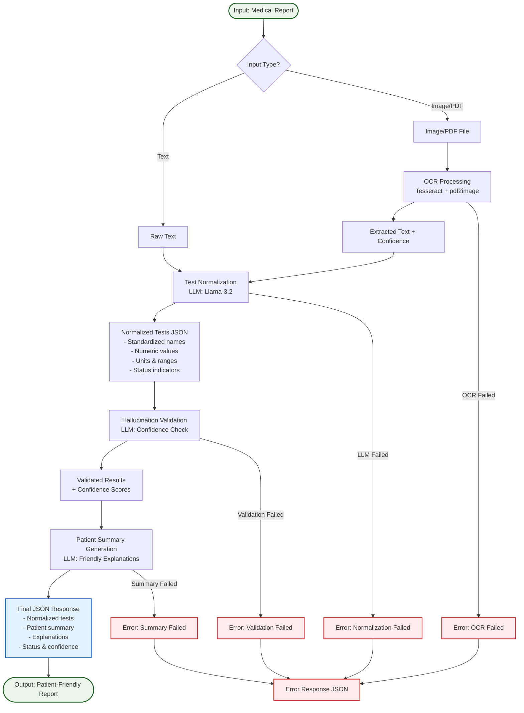
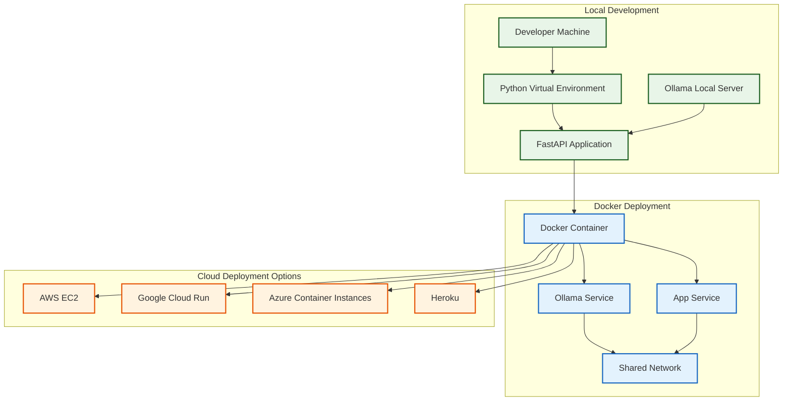

# AI-Powered Medical Report Simplifier - Technical Architecture

## System Architecture Diagram

## Data Flow Diagram

## Component Architecture

## Technology Stack

## API Endpoints Structure

## Processing Pipeline Details

## Deployment Architecture

## Key Features & Capabilities

### 🔍 **Input Processing**
- **Text Reports**: Direct processing of typed medical reports
- **Image/PDF Reports**: OCR extraction with Tesseract
- **Error Handling**: Robust OCR error detection and recovery

### 🤖 **AI Processing**
- **Local LLM**: Ollama with Llama-3.2 for privacy
- **Medical Normalization**: Standardized test names, values, units
- **Hallucination Detection**: LLM-based validation to prevent false data
- **Patient-Friendly Output**: Simple, non-diagnostic explanations

### 🛡️ **Guardrails & Validation**
- **Confidence Scoring**: OCR and LLM confidence tracking
- **Data Integrity**: Validation against original input
- **Error Recovery**: Graceful handling of processing failures
- **Structured Output**: Consistent JSON schema validation

### 🚀 **Deployment Ready**
- **Docker Support**: Complete containerization
- **Environment Config**: Flexible configuration management
- **API Documentation**: Auto-generated Swagger/ReDoc
- **Health Monitoring**: Built-in health check endpoints

## Performance Characteristics

- **Processing Time**: 10-30 seconds for typical reports
- **Concurrent Requests**: Supports multiple simultaneous users
- **Memory Usage**: ~2-4GB with Ollama + application
- **Storage**: Minimal (no database required)
- **Scalability**: Horizontal scaling via Docker containers
